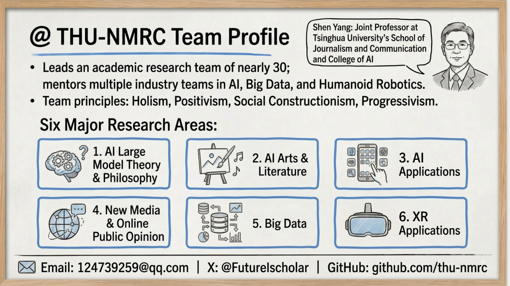

# THU ZeeLin Research Reports

English | [中文](README.zh-CN.md)

Public report library of THU ZeeLin Research.

This repository presents public research reports and ongoing report releases from THU ZeeLin Research. The collection focuses on artificial intelligence, large models, media evolution, online public opinion, digital governance, and related frontier topics. Readers can browse the repository or visit the online library to access featured reports and full documents.

## About the Team

THU ZeeLin Research works at the intersection of technology, media, and society. Our research spans AI large model theory and philosophy, AI arts and literature, AI applications, new media and online public opinion, big data, and XR applications.

We value interdisciplinary methods and examine emerging technologies from multiple perspectives, including technical capability, social impact, industrial pathways, and cultural expression.

## Research Feature

One distinctive feature of the team is our ongoing exploration of human-AI collaborative research. In our workflow, AI is not only used for information gathering, synthesis, and structural analysis, but also participates directly in report drafting and expression.

This approach treats AI as both a research tool and a research subject, allowing us to expand knowledge production while continuing to ground the work in research judgment and editorial intent.

## OpenClaw Highlights

The two most recent OpenClaw reports are among the most representative works in this repository. They were produced through an AI-driven report generation process in which intelligent agents participated in research organization, analytical generation, and written expression.

Their significance lies not only in the topic itself, but also in the method of production: AI participated in the making of reports about AI. This makes the OpenClaw series an important example of our broader effort to explore new research methods through AI-assisted knowledge production.

## Visit the Library

Report website:

[https://thu-nmrc.github.io/THU-ZeeLin-Reports/](https://thu-nmrc.github.io/THU-ZeeLin-Reports/)

## Repository Note

This repository is maintained as a public-facing library of reports and related experimental research outputs from THU ZeeLin Research.
